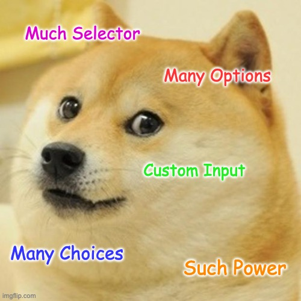

# \<much-select>



A web component - powered by Elm - that will create a powerful select menu.

## Prior Art/Inspiration/Goals

The project draws heavy inspiration from the jquery based [selectize.js](https://selectize.github.io/selectize.js/).

The need for this project is that we want to use selectize.js however we need the over all app to be built in [Elm](https://elm-lang.org/). Elm needs to "own" the DOM and selectize is built in a way that's not compatible with that. 

The goal for this project to achieve near feature parity with selectize using web components. The API will be different, so it will not be a drop in replacement but hopefully it will not be too hard to replace one with the other.

### Other Similar Projects

- [React Select](https://react-select.com/home)
- [inkuzmin/elm-multiselect](https://package.elm-lang.org/packages/inkuzmin/elm-multiselect/)

## Installation

```bash
npm i much-select-elm
```

## Usage

The npm package gives you the class `MuchSelect` (which inherits from `HTMLElement`), what you need to do is use it to define your own element.

```javascript
import MuchSelect from "@getdrip/much-select-elm";

if (!customElements.get("much-select")) {
  // Putting guard rails around this because browsers do not like
  //  having the same custom element defined more than once.
  window.customElements.define("much-select", MuchSelect);
}
```

## Development

### Pre-requisites
This project manages its Node version with [asdf](https://github.com/asdf-vm/asdf)

You'll need asdf installed as well as the [asdf nodejs plugin](https://github.com/asdf-vm/asdf-nodejs)
(`gpg` is a dependency used by asdf to verify plugin asset validity)

```bash
brew install gpg
brew install asdf
asdf plugin add nodejs https://github.com/asdf-vm/asdf-nodejs.git
```
t
To work on this project, clone the repo to your machine then:

```bash
asdf install
npm install
npm start
```


### Initial Setup

Just do like you'd expect to get started. Only development dependencies.

``` bash
npm install
npx elm-tooling install
```

### Watch and Develop

To run a webpack development server with the sandbox/demo page:

```bash
npm start
```

Now you can visit http://localhost:1234

### Production Build

To do a production build run

```bash
npm run build
```

## API

### DOM

#### Attributes

##### `selected-value`

The `selected-value` attribute is used to set the value of the `<much-select>`.

##### `placeholder`

The `placeholder` attribute is used to set the placeholder in the text input of the `<much-select>`. Just like in the `<input type="text">` it should only show up if the input is empty. 

##### `allow-custom-options`

The `allow-custom-options` attribute will allow the user to add new options to the `<much-select>`, not just one of given ones. Of course, you will want to know when that's happened. You might be able to _just_ look at the value, but you might want to know when a custom option has been added too. For that there's the `customValueSelected` event. 

#### Options

### Events

##### `valueChanged`

This event fires any time the value changes.

##### `valueCleared`

This event fires if the `<much-select>` is cleared.

##### `optionSelected`

This event fires if the `<much-select>` is in single or multi select mode but it's _mostly_ for mulit select mode. It will just have the newly selected option in it (not all the selected options like the `valueChanged` event).

##### `optionDeselected`

This event fires if the `<much-select>` is in single or multi select mode but it's _mostly_ for mulit select mode. It will just have the newly deselected option in it. This is kinda of the inverse of the `optionSelected` event.

##### `inputKeyUp`

This event fires every time a user types in the `#input-filter` for filtering the options.

##### `inputKeyUpDebounced`

This event fires every time a user types in the `#input-filter` but is debounced by half a second. The idea here is if you want to hook a `<much-select>` up to an API you can use this event to kick off your API calls to add additional options based on what the user is has "searched" for.

### Functions
