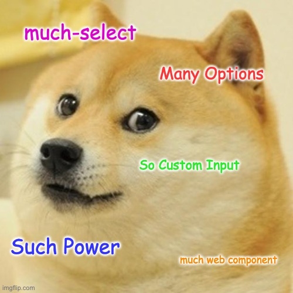

# \<much-select>



A web component - powered by Elm - that will create a powerful select menu.

## Prior Art, Inspiration, and Goals

The project draws heavy inspiration from the jquery based [selectize.js](https://selectize.github.io/selectize.js/).

The need for this project is that we want to use selectize.js however we need the over all app to be built in [Elm](https://elm-lang.org/). Elm needs to "own" the DOM and selectize is built in a way that's not compatible with that. 

The goal for this project to achieve near feature parity with selectize using web components. The API will be different, so it will not be a drop in replacement, but hopefully it will not be too hard to replace one with the other.

### Other Similar Projects

- [React Select](https://react-select.com/home)
- [inkuzmin/elm-multiselect](https://package.elm-lang.org/packages/inkuzmin/elm-multiselect/)

## Installation

```bash
npm i much-select-elm
```

## Usage

The npm package provides the class `MuchSelect` (which inherits from `HTMLElement`). To use it, use something like the following to define a custom element.

```javascript
import MuchSelect from "@getdrip/much-select-elm";

if (!customElements.get("much-select")) {
  // Putting guard rails around this because browsers do not like
  //  having the same custom element defined more than once.
  window.customElements.define("much-select", MuchSelect);
}
```

## Development

### Pre-requisites

#### asdf
This project manages its Node version with [asdf](https://github.com/asdf-vm/asdf)

#### asdf-node-js

You'll need `asdf` installed as well as the [asdf nodejs plugin](https://github.com/asdf-vm/asdf-nodejs)
(`gpg` is a dependency used by asdf to verify plugin asset validity)

```bash
brew install gpg
brew install asdf
asdf plugin add nodejs https://github.com/asdf-vm/asdf-nodejs.git
```

#### soupault

We use a static site generator called [Soupault](https://soupault.app/) to make the sandbox.
There [several ways to install](https://soupault.app/install/) it. I recommend using the OPAM method.

### Initial Setup

To work on this project, clone the repo to your machine then:

```bash
asdf install
npm install
npm start
```

Just do like you'd expect to get started. Only development dependencies.

``` bash
npm install
npx elm-tooling install
```

### Watch and Develop

To run a webpack development server with the sandbox/demo page:

```bash
npm start
```

Now you can visit http://localhost:1234

### Production Build

To do a production build run

```bash
npm run build
```

## API

### DOM

#### Attributes

##### `allow-custom-options`

The `allow-custom-options` attribute will allow the user to add new options to the `<much-select>`, not just one of given ones. Of course, you will want to know when that's happened. You might be able to _just_ look at the value, but you might want to know when a custom option has been added too. For that there's the `customValueSelected` event.

This is a boolean attribute, so it's presents means it's true. It's absence means it's false. So the default value for allowing custom options is false.

##### `disabled`

The `disabled` attribute prevents the `<much-select>` from responding to user input. It is supposed to work like disabling any of the standard form elements.

This is a boolean attribute, so it's presents means it's true. It's absence means it's false. So the default is for a `<much-select>` to not be disabled.

##### `events-only`

The `events-only` attribute prevents the `<much-select>` from automatically updating its "light DOM". This is important for using `<much-select>` inside of an Elm app (and possibly other situations too).

This is a boolean attribute, so if the `events-only` attribute is present means it's true. It's absence means it's false. So the default is for a `<much-select>` to not be in events only mode, and it will try to update the light DOM to reflect it's internal state.

##### `max-dropdown-items`

The `max-dropdown-items` attribute sets the maxiumn number of items that much-selelct will attempt to render in the dropdown.

The default value is 1000.

The `max-dropdown-items` attribute needs a positive integer for its value.

This is also not enforced when a `<much-select>` is using the `datalist` `output-style`.

If you set the value of `max-dropdown-items` to `0` there will be no limit. Would  anyone want that? Should it even be allowed?.

##### `multi-select`

The `multi-select` attribute puts the `<much-select>` into multi select mode, which allows the user to select multiple values.

This is a boolean attribute, so if the `mulit-select` attribute is present, the `<much-select>` will be in mulit-select mode. If not, it will be in the defaul single select mode.

##### `multi-select-single-item-removal`

The `multi-select-single-item-removal` attribute adds buttons to remove individual selected options. This only works if the `<much-select>` is in mulit-select mode.

This is a boolean attribute, so if the `multi-select-single-item-removal` is present the `<much-select>` will have the selected option removal buttons visible. If not, the default behavior is to not show them. 

##### `option-sorting`

The `option-sorting` attribute allows you to specify what order the options should appear in the dropdown.

The options for this are:
 - `no-sorting` (default) respect the value the options are in already
 - `by-option-label` sort the options alphabetically by their label

##### `output-style`

The `output-style` attribute allows you to change the way a `<much-select>` is rendered, which give it a different look and feel. Hopefully you can find one that matches the user experience that best fits your circumstances.

The options for this are:
 - `custom-html` (default)
 - `datalist`

`custom-html` give you a lot of power to style the `<much-select>` but a lot of the markup in hand rolled and an attempt to feel like the user is expecting but even our best effort here will probably fall short.

`datalist` uses the datalist feature of the `<input>` element to render the dropdown part. This can work well if you want to allow the user to type in a text field in a more free form way, and you want to make it easy for them to select a value they might want. It also uses more native widgets. Multi select mode can take up a lot of vertical space though.

##### `placeholder`

The `placeholder` attribute is used to set the placeholder in the text input of the `<much-select>`. Just like in the `<input type="text">` it should only show up if the input is empty.

##### `search-string-minimum-length`

The `search-string-minimum-length` attribute is used to manage how many characters a user needs to type in the `#input-filter` before the options in the dropdown start being filtered.

##### `selected-value`

The `selected-value` attribute is used to set the value of the `<much-select>`.

##### `show-dropdown-footer`

The `show-dropdown-footer` attribute is used to show the footer in the dropdown of the `<much-select>`. The footer contains potentially useful information about how many options are really available but might not be visible because the results are being filter.

#### Slots

##### `no-options`

If there are no options to display, show this message.

##### `no-options`

If there are no options to display, show this message.

##### `no-filtered-options`

If the user has typed in a search filter that just does not have any good matches show this message.

#### Options

### Events

##### `valueChanged`

This event fires any time the value changes.

##### `valueCleared`

This event fires if the `<much-select>` is cleared.

##### `optionSelected`

This event fires if the `<much-select>` is in single or multi select mode, but it's _mostly_ for multi select mode. It will just have the newly selected option in it (not all the selected options like the `valueChanged` event).

##### `optionDeselected`

This event fires if the `<much-select>` is in single or multi select mode, but it's _mostly_ for multi select mode. It will just have the newly deselected option in it. This is kinda of the inverse of the `optionSelected` event.

##### `inputKeyUp`

This event fires every time a user types in the `#input-filter` for filtering the options.

##### `inputKeyUpDebounced`

This event fires every time a user types in the `#input-filter` but is debounced by half a second. The idea here is if you want to hook a `<much-select>` up to an API you can use this event to kick off your API calls to add additional options based on what the user is has "searched" for.

### Functions
